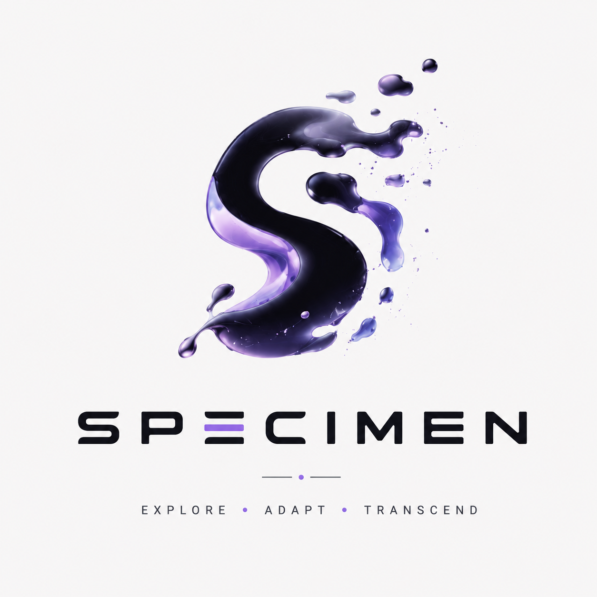

<h1 align="center">
  
</h1>

**Specimen** is a single-player 3D puzzle-platformer set in an abandoned biological research facility. The player positions and switches between three slime bodies whose incompatible abilities must be combined to escape.

- **Bob** sticks, climbs, and performs powerful charged bounces.
- **Goop** dissolves specifically marked geometry.
- **Volt** emits light and powers electrical machinery.

Inactive slimes remain in the level, so they can hold pressure plates, complete circuits, or illuminate spaces while another slime is controlled.

## Technology

The game is built with TypeScript, Three.js, Vite, DOM/CSS UI, handwritten GLSL shaders, and Blender/GLB assets.

The project is intentionally short and authored, with predictable kinematic gameplay collision kept separate from the deforming visual slime mesh.

## Development

The supported toolchain is Node.js 24.x (24.14.1 is pinned in `.nvmrc`) and npm
11.x (11.18.0 is recorded in `package.json`). After selecting the pinned Node.js
version, install the locked dependencies:

```bash
nvm use
npm ci
```

Start the Vite development server:

```bash
npm run dev
```

Create the production build in `dist/` or preview that output locally:

```bash
npm run build
npm run preview
```

Vite is configured with a relative base, so the contents of `dist/` can be served
from a domain root, a nested route, or an extracted archive directory without
rewriting asset URLs.

Create and validate the assessment-ready ZIP archive with:

```bash
npm run archive
```

The generated `artifacts/specimen-production.zip` contains the contents of
`dist/` at its root and is intentionally ignored by Git. See
[`docs/operations/deployment.md`](docs/operations/deployment.md) for archive
inspection, external nested-path testing, publication, verification, and retry
steps.

## Continuous integration

Two workflows separate merge checks from submission packaging:

- **PR validation** runs on new and updated PRs targeting `main`. Unit tests and
  production verification run in parallel. Production verification builds once,
  validates static files, and smoke-tests the game from a nested HTTP path.
  New commits cancel obsolete runs.
- **Submission build** runs on pushes to `main` and can be started manually on
  `main`. It builds the exact event revision, verifies the extracted archive,
  and publishes `specimen-<12-character-commit>.zip` with a checksum and Tiny
  File Manager handoff instructions. Manual runs can enable the full shader and
  lifecycle browser suite.

Require the **Unit tests** and **Production smoke** PR checks plus a teammate's
approval before merging. See
[`docs/operations/continuous-integration.md`](docs/operations/continuous-integration.md)
for local commands, required-check activation, and the limits of automation.
Upload the finished files through the Moodle-linked Tiny File Manager; a ZIP
upload alone does not publish the game.

## Documentation

[`docs/README.md`](docs/README.md) indexes the current architecture, gameplay,
level, operations, and decision records. Historical screenshots, videos, logs,
and issue-closure reports are kept with their issue, pull request, or CI run
rather than in the source tree.
