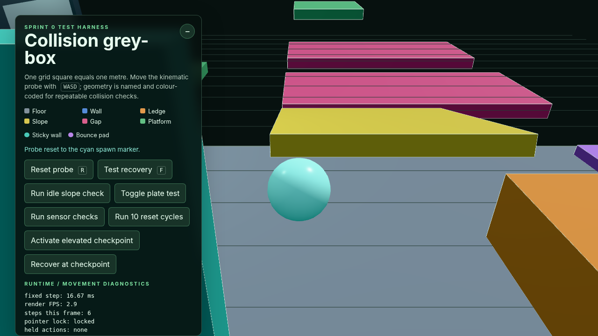
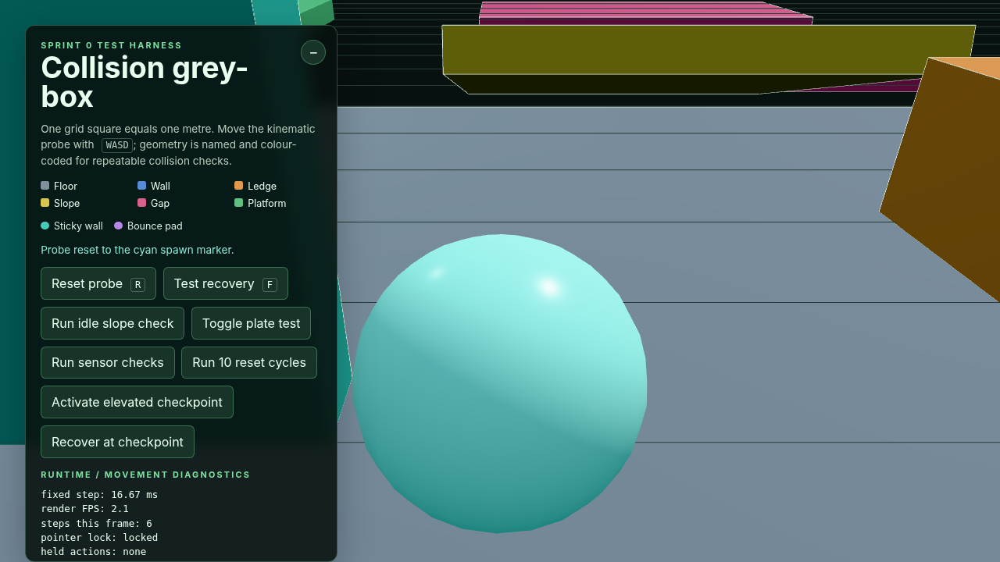
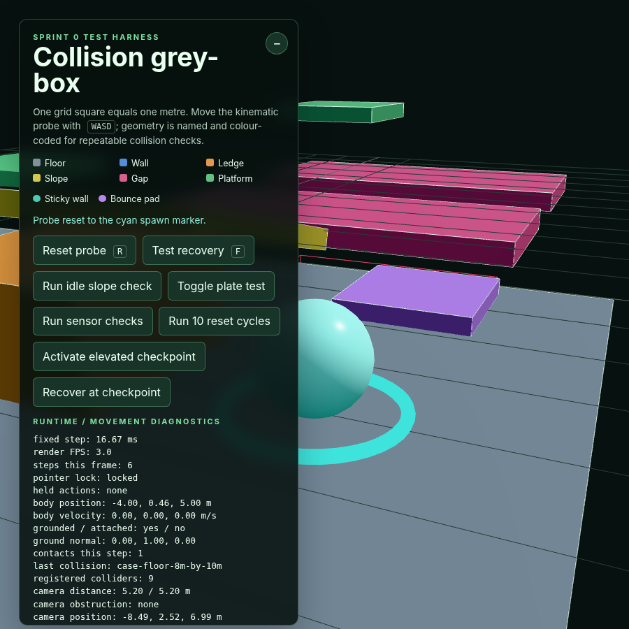
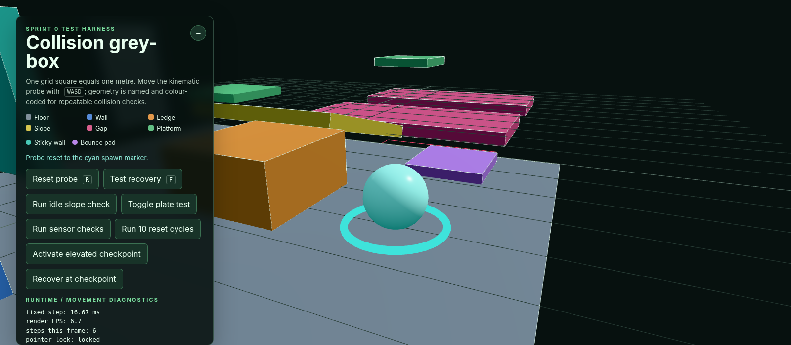

# Issue #14 verification evidence

Verified on 19 August 2026 with Node.js 24.14.1, npm 11.18.0, and
HeadlessChrome 152.0.0.0 using ANGLE/SwiftShader WebGL. The tested Issue #14
worktree is on `feat/third-person-cam` after integrating `origin/main` through
`6a185d3`.

## Automated checks

```text
npm ci              # 25 packages installed; 0 vulnerabilities
npm test            # 9 passed, 0 failed
npm run type-check  # passed
npm run build       # passed with Vite 8.2.1
git diff --check    # passed
```

The camera tests cover pointer sensitivity/inversion, immediate obstruction
shortening, obstruction overriding the preferred minimum when required for
clearance, smooth full-distance restoration, the normal minimum distance,
frame-rate-independent exponential recovery, camera/movement collision layer
filtering, read-only movement-state preservation, gameplay-up transition
invariance, and an integrated wall contraction/recovery path.

The production build retains Vite's existing advisory for the single JavaScript
chunk over 500 kB (`587.63 kB` minified, `147.97 kB` gzip) after integrating
the charged-jump work from `main`. No dependency or asset was added by Issue
#14.

## Production browser checks

The built `dist/` output was served with `npm run preview -- --host 127.0.0.1`.
The HTML, generated JavaScript, and generated CSS returned HTTP 200. There were
no application console errors, uncaught exceptions, failed requests, or asset
404s. Four WebGL driver warnings were emitted only while browser automation
captured screenshots; they report SwiftShader `ReadPixels` stalls and are not
application failures.

Pointer lock was acquired by clicking the canvas. A synthetic locked-pointer
delta of `(714, -100)` moved the camera from `(-4.00, 2.42, 9.95)` to
`(-8.53, 3.37, 5.00)` while the body remained at spawn, confirming both orbit
axes use the central input handoff.

The authored default wall and nearby ledge were exercised as wall, passage,
and inside/outside-corner cases. With the camera orbit facing the wall, the
boom contracted from its normal `5.20 m` to `0.70 m` while reporting
`case-wall-default-3m-high`. At direct close contact it reached `0.25 m`, with
the camera centre still separated from the wall by the configured swept-sphere
radius and contact buffer. Moving around the ledge and away from the wall
cleared the obstruction; the distance recovered through `5.09 m` to `5.19 m`
and settled at `5.20 m` without retaining an offset.

The `F` recovery transition exercised a fast moving/falling target and overhead
geometry from below. While the body was below the floor at
`(6.50, -3.35, 2.00)`, the camera shortened to `3.20 m` against
`case-gap-near-edge`. After checkpoint-style reset it snapped its follow target
back to spawn, cleared the obstruction, and recovered to `5.10 m` within the
captured interval.

After merging the upstream charged-jump controller, a 0.40-second Space hold
entered the `charging` state and launched at `7.34 m/s` with 71% recorded
charge. The camera followed the body to `1.54 m` height without changing its
open-space `5.20 m` boom distance or reporting a false obstruction. The body
landed at spawn with one `7.06 m/s` landing event and the camera returned to the
same stable framing.

Live resizing was checked at DPR 1:

| Viewport | Result |
| --- | --- |
| 1280 × 720 (16:9) | Open and obstructed framing rendered without clipping through the blocking wall. |
| 900 × 900 (square/narrow) | Vertical target framing remained stable; camera returned to 5.20 m. |
| 1600 × 700 (wide) | Extra horizontal route space was revealed without stretching or changing boom distance. |

The camera creates no geometry, material, texture, render target, or event
listener. Its query hit, vectors, matrices, and quaternions are reused. After
the scene had fully warmed, two consecutive ten-cycle puzzle reset regressions
both reported 31 GPU geometries and 1 texture, with no continuing growth. The
software-rendered frame rate is not representative hardware performance
evidence.

## Screenshots









## Remaining hands-on evidence

Sticky attachment/gameplay-up transitions remain unavailable by design and
must be rechecked when their owning movement issue lands.

Before the PR is considered fully evidenced, capture representative traversal
footage in Chrome on Ubuntu/lab-class hardware. The footage should show pointer
orbit, the wall/ledge passage, inside and outside corners, an overhead
obstruction, obstruction recovery, rapid direction changes, and charged jumps.
This hands-on pass should be used for final judgement of jitter, lag,
sensitivity, and platforming comfort; headless SwiftShader timing is not
suitable for that judgement.
