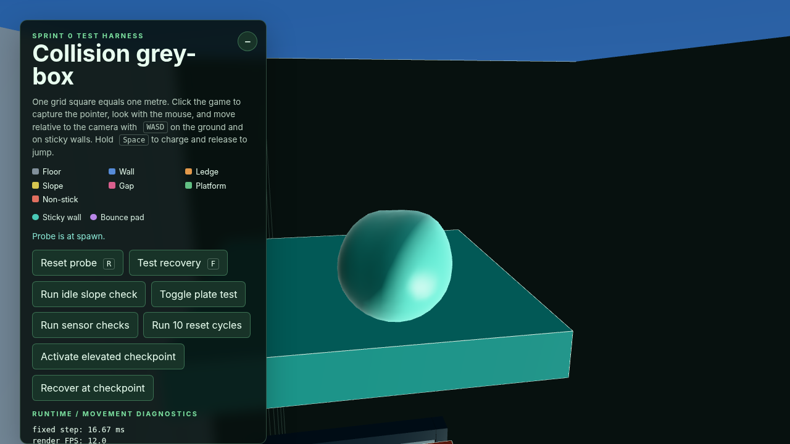

# Issue #15 wall adhesion and camera-comfort decision

Verified on 19 August 2026 with Node.js 24.14.1, npm 11.18.0, Vite 8.2.1,
and the production preview in headless Chrome for Testing using WebGL/SwiftShader.

## Decision

**Engineering GO** for the current wall-camera and traversal model within the
explicitly authored Sprint 1 envelope: planar near-vertical sticky walls,
the proven convex wall-to-top transition, and broad walkable sticky tops. This
is not approval for ceilings, curved/free-form crawling, or arbitrary scene
geometry.

The safe fallback is also the production boundary: only collision meshes
registered with `surfaceTag = 'sticky'` can attach or continue an adhesive
route. Level authors can constrain the route to the proven wall/top geometry by
leaving every other surface `default` or `nonStick`; no alternate controller is
required.

The engineering decision is ready for review. Final subjective comfort sign-off
still requires the post-fix hands-on re-test and the issue's remaining team
feedback described below.

## Automated and production checks

```text
npm test            # 28 passed, 0 failed
npm run type-check  # passed
npm run build       # passed with Vite 8.2.1
git diff --check    # passed
Playwright          # 2 production-preview scenarios passed
```

The build produced a 661.24 kB minified / 164.58 kB gzip JavaScript chunk and
retained Vite's known advisory for a chunk over 500 kB. This total includes the
laser-hazard and elevator work merged from `main`; the Issue #15 conflict
resolution added no dependency or asset-loading boundary, so code splitting
remains outside this focused fix.

## Selected rule and rationale

- The authoritative body's `gameplayUp` changes immediately to the outward
  sticky-wall normal on attachment.
- CameraRig exponentially damps a private camera-up toward `gameplayUp` and
  transports the existing orbit heading. It preserves accumulated yaw/pitch
  and never writes smoothed state back to movement.
- Attached WASD follows the displayed camera basis projected onto the current
  support plane. Pitch is excluded, so screen-left/right cannot be reversed by
  wall normal or camera pitch.
- The resolved world-space direction is fixed for a complete simulation step.
  A step that begins attached retains its wall plane through jump release;
  ordinary slope jumps use the current airborne world-up plane.
- A valid adhesive convex edge rotates tangent velocity into the adjacent
  supported plane. A walkable sticky top returns to grounded world-up movement;
  a missing/non-adhesive/unsupported face detaches.
- Detachment and landing restore world-up gameplay while camera up returns
  smoothly without recentering or discarding look intent.

This rule keeps mouse look low-latency, makes both ground and wall input
camera-relative, and limits camera roll to authored support changes.

## Technically verified

The production route was repeated with perpendicular and two diagonal wall
approaches. The checks covered attachment, camera-relative climb/down,
left/right traversal during partial camera-up damping and after it settled,
reversal, camera yaw/pitch while attached, charged wall jump, detachment,
fall/landing, camera return, camera-relative ground movement, and facing
alignment with actual velocity. Ordinary flat-ground and authored 15-degree
slope jumps were also repeated in the production preview.

The fallback route separately proved:

- an ordinary registered wall remained non-adhesive with world-up unchanged;
- the teal tagged wall attached and reported its sticky surface/mesh;
- climbing over its convex top retained sticky support, rotated travel onto the
  top, and became stable grounded movement rather than dropping into the air;
- the production page produced no console errors, failed requests, HTTP 4xx/5xx
  responses, or asset 404s.

Focused automated coverage verifies partially damped and fully settled camera
directions on multiple wall normals/yaws, wall-jump launch/event direction,
release-step wall coordinates, post-release slope-jump air coordinates, sticky
wall-to-top continuity, camera teleport presentation reset, facing's 0.05 m/s
threshold, shortest-angle facing, and render-clock independence of directional
slime deformation.

Headless browser automation establishes state continuity and repeatability; it
does **not** prove absence of nausea or subjective comfort.

## Subjective human evidence

One tester (the issue requester) originally reported that wall traversal and
camera behaviour felt good overall and that they were happy with the result.
During the final pass, the same tester identified two concrete exceptions:
wall controls did not feel camera-relative and appeared left/right inverted,
and adhesion did not continue over a wall ledge. Both were corrected in this
branch and are now technically covered.

The tester has not yet recorded a hands-on comfort result for the post-fix
build. No other team-member comfort notes were found in the issue or repository.
Required human follow-up is therefore:

- requester: re-test the post-fix wall controls and convex top transition;
- other team members: record their own comfort/control notes rather than
  inheriting the requester's opinion;
- a non-author teammate: review and approve the pull request.

## Evidence

[Repeated chosen wall route: approaches, attached camera/input, wall jump,
landing, and ground return](issue-15-wall-route.webm)

[Authored fallback comparison: ordinary non-adhesive wall and sticky wall/top
route](issue-15-authored-fallback.webm)



The prior world-axis wall-input mode was not resurrected solely to capture an
A/B clip. The route clip repeats the selected current mode, while the fallback
clip provides a meaningful runtime comparison between ordinary and authored
sticky geometry.

## Level 1 authoring outcome

[The adhesion authoring guide](../adhesion-surfaces.md) now records the exact
camera/input rule, sticky registration contract, supported geometry, convex
wall/top transition, landing-space guidance, comfort fallback, and unsupported
ceilings/curves/arbitrary crawling. Ordinary geometry must remain untagged or
explicitly non-stick.

## Performance, resources, and credits

Wall input projection reuses CameraRig vectors. Edge continuation reuses its
vectors, quaternion, and collision-hit object and adds a short sphere sweep only
when an attached support probe has already failed. Normal supported traversal,
rendering, draw calls, and GPU resources are unchanged. No speculative
optimization or tuning change was made.

Issue #15 introduced no third-party library, runtime dependency, asset, code,
or external reference. `CREDITS.md` therefore needs no new entry. Playwright was
used only as local verification tooling and was not added to the project.

## Known limitations and follow-ups

- Ceilings, inverted traversal, curved/free-form crawling, arbitrary scene
  geometry, acute/concave seams, and tiny or rapidly changing support faces are
  outside the validated Sprint 1 envelope.
- The current grey-box has no authored wall-to-wall corner. The controller
  accepts a valid adjacent sticky wall normal, but that route still needs
  level-specific runtime verification before Level 1 depends on it.
- The finite grey-box route is technical evidence, not a production Level 1
  layout or human vestibular-comfort study.
- Software-rendered headless FPS is load-dependent and is not presented as a
  hardware performance measurement.
- Moving-target camera follow damping retains the previously measured bounded
  render-rate-dependent lag; no visible defect justified redesigning it here.
- Cosmetic slime deformation remains a fixed 60 Hz simulation. Only the stale
  render-orientation dependency was removed.
