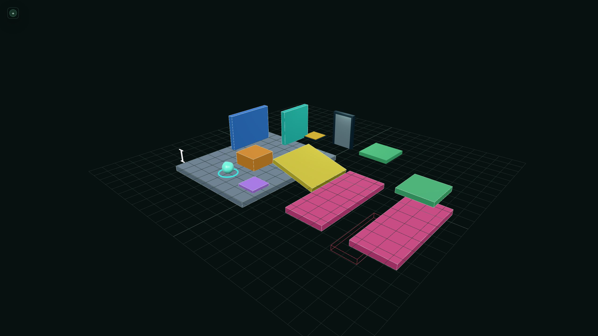
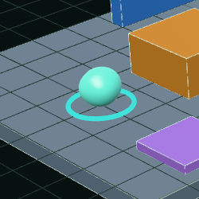
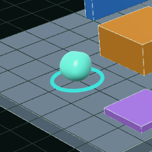

# Issue #16 verification evidence

Verified on 19 August 2026 with Node.js 24.14.1, npm 11.18.0, and headless
Chrome for Testing 152.0.7977.8 using ANGLE/SwiftShader WebGL.

## Automated checks

```text
npm ci              # 25 packages installed; 0 vulnerabilities
npm run type-check  # passed
npm run build       # passed with Vite 8.2.1
git diff --check    # passed
```

Vite emitted its existing advisory that the single application chunk is over
500 kB (`579.56 kB` minified / `146.82 kB` gzip). This is not a build or shader
warning; code splitting remains deferred until the game has a useful loading
boundary.

The repository has no lint, format, or automated test script. No test framework
was added solely for the material. Material construction, default uniforms,
time update, colour mutation, and disposal signalling were exercised directly
in the browser in addition to the TypeScript and production-build checks.

## Browser and visual checks

The development harness and production build were exercised with Playwright.
The player visual was inspected at rest, after held `W` and `D` traversal, and
after reset. The collider/body position remained authoritative while the mesh
wobbled independently. The base stayed visually planted, the overall sphere
silhouette remained recognisable, and the corrected highlights followed the
deformed surface without visible lighting separation.

The mint diffuse body, tight white wet highlight, and cool Fresnel rim remained
readable under the existing clinical hemisphere/directional test lighting.
Two captured animation phases show controlled silhouette change while the base
mask remains stable. The rim was observed around grazing-facing edges and
changed with the corrected normal/view relationship. Changing `uBaseColour`
through `setBaseColour()` changed the same uniform colour object without GLSL
edits or material recreation.

Development and production consoles contained no GLSL compile/link messages,
Three.js shader warnings, uncaught exceptions, or application errors. Network
inspection found no failed requests or asset 404s. Headless Chrome emitted its
known `ReadPixels` GPU-stall warnings while screenshots were captured; the same
warnings existed before the shader and originate from browser automation.

## Frame-cost and resource observation

At 1280 × 720 CSS pixels and DPR 1, both the stock-material baseline and custom
shader frame reported 32 draw calls, 1,748 triangles, 31 GPU geometries, and 1
texture. The shader therefore adds no draw call, geometry, or texture residency.
It replaces one material on the existing 24 × 16 segment sphere.

A 109-frame `requestAnimationFrame` sample was captured before implementation
(63.01 ms mean, 57.8 ms median) and repeated afterward (137.57 ms mean, 121.9
ms median). These absolute numbers are not treated as representative GPU cost:
the shared host had multiple simultaneous SwiftShader GPU processes and load
averages above 14 during the later sample, and the scene's observed FPS varied
widely between otherwise identical tool calls. The stable renderer counters,
single small affected mesh, absence of texture reads/loops, and source review
show no obviously disproportionate workload; physical lab-hardware profiling
remains the appropriate follow-up before release.

Reload and Vite hot replacement returned to the same 31 geometries / 1 texture
diagnostic rather than accumulating resources. `GreyboxCollisionScene.dispose()`
continues to dispose the owned sphere geometry and its `SlimeMaterial` exactly
through the established level lifecycle.

## Screenshots







The final two stills are phases from the running shader rather than edited
mock-ups. The repository has no motion-capture convention or recording script,
so no video asset was added solely for this issue.

## Authorship and scope

The GLSL and deformation/lighting equations were handwritten for Specimen. No
external shader code, tutorial, texture, asset, or equation was copied or
materially adapted, so `CREDITS.md` requires no new third-party entry.

No movement, camera, renderer-light hierarchy, gameplay squash/stretch,
dissolve, soft-body, or fluid behaviour was introduced.
