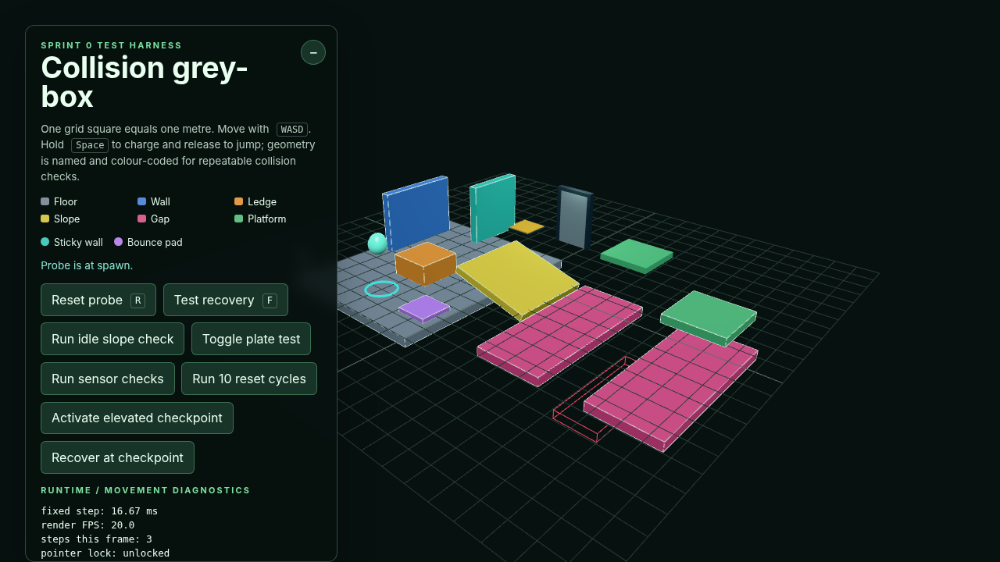

# Issue #17 verification evidence

Verified on 19 August 2026 in the grey-box movement harness with Chrome for
Testing through Playwright. Both the Vite development server and the served
production build were exercised.

## Checks

```text
npm run build       # baseline passed before editing
npm run type-check  # passed after implementation
npm run build       # passed after implementation
git diff --check    # passed
```

Vite emitted the existing advisory for the application's single chunk over
500 kB (`605.95 kB` minified / `152.41 kB` gzip). It emitted no GLSL or shader
warning.

The repository has no automated test script, so no test framework was added
solely for the visual controller. Browser-side contract checks constructed a
`SlimeVisual` directly and exercised its existing update/event API without
adding production test hooks.

## Browser scenarios

- Idle was observed for several seconds: the two-wave motion remained subtle
  and the contact band stayed close to the cyan collider marker.
- Slow acceleration, full-speed movement, release-to-stop, and direction
  change were exercised with `WASD`. Diagnostics reached `uSpeed = 0.93` at an
  authoritative 5.5 m/s and the visual direction followed the movement vector.
- Partial charge reached 43% gameplay charge / 35% smoothed visual charge;
  full charge reached the maximum and was visibly more compressed.
- Releasing a full charge produced an 8.8 m/s launch, visible axial stretch,
  airborne velocity stretch, and one 8.6 m/s landing event. A 57%-charge jump
  landed at 6.22 m/s, producing a lower normalised impact than the full jump.
- A horizontal collision stored local impact normal `(0, 0, 1)`, rather than
  using the floor normal. The synthetic contract check separately supplied a
  wall normal `(1, 0, 0)` and produced impact point `(-0.45, 0, 0)`.
- The existing 15-degree idle-slope regression passed: 10 s, 0.0000 m tangent
  drift, 0.0000 m/s final speed, and zero ungrounded steps.
- Ten puzzle/reset cycles passed. Render diagnostics returned to 32 draw calls,
  1,748 triangles, 31 geometries and 1 texture.

The production console contained zero warnings/errors after locomotion,
charge, jump and landing. Its three requests (`index.html`, JavaScript and CSS)
all returned 200; no shader compile/link messages or asset 404s appeared.
Development screenshot capture emitted only Chrome's known `ReadPixels`
performance warning.

## Surface-relative and long-session checks

The browser-side controller check supplied states that current gameplay cannot
yet author:

```text
ceiling: surface normal (0, -1, 0), move direction (0, 0, 1), speed 0.99995
wall:    surface normal (1, 0, 0), move direction (0, 1, 0), speed 0.99998
```

This directly exercised the antiparallel floor-to-ceiling transition and the
wall tangent projection. After 500,000 updates at 120 Hz, the locomotion phase
remained finite and inside `[0, 2π)`. The idle clock retains Issue #16's common
100/79-wave period, while locomotion owns its separate full-cycle phase; speed
changes therefore cannot make the long-session time wrap discontinuous.

A corrective supplied-state sweep rotated the support normal through a full
360 degrees over 720 fixed updates, covering floor, both walls and ceiling.
The transported tangent's largest step was `0.5°` (minimum consecutive dot
`0.9999619`), both frame vectors remained unit length within floating-point
tolerance, and maximum normal/tangent dot error was `5.6e-17`. The sampled idle
wave's largest adjacent change was `0.0363`, with no threshold jump. A direct
floor-to-ceiling target converged to normal `(0, -1, 0)` with tangent
`(0, 0, 1)`, both finite, unit length and orthogonal. Reset deterministically
restored tangent `(0, 0, 1)`.

For the corrective attached-locomotion contract, the supplied state
`grounded=false`, `attached=true`, wall normal `(1, 0, 0)` and tangent speed
5.5 m/s converged to support/speed `1.0`. Slither amplitude, support flatten,
locomotion stretch and lateral-shift amplitude matched the grounded baseline
(`0.022`, `0.035`, `0.055`, `0.014` respectively); the sticky peel gate was
active and airborne stretch was effectively zero. This was a supplied-state
visual check, not playable sticky traversal.

Bounce and sticky response values were also exercised through the visual API:
a bounce impact selected elasticity `1.65`, while a wall impact preserved its
supplied local normal and strength. These recorded checks predate the later
authoritative wall-attachment and bounce integration.

## Frame cost and resources

The renderer remained at the Issue #16 baseline of 32 draw calls, 1,748
triangles, 31 geometries and 1 texture. Movement adds uniform writes and fixed
vertex arithmetic to the existing mesh; it adds no draw call, texture,
per-frame geometry update, or per-frame vector allocation. The shared host's
headless SwiftShader FPS was load-dependent, so renderer counters and source
inspection are recorded instead of presenting a misleading wall-clock GPU
benchmark.

`SlimeVisual.dispose()` removes its mesh and disposes its one owned sphere
geometry and `SlimeMaterial`. Reset reuses those resources rather than
recreating them. A direct browser lifecycle check observed exactly one geometry
dispose event, one material dispose event, and a null mesh parent afterward;
the same check constructed the visual with `0xff0000` and read that identity
colour back from the existing `uBaseColour` uniform.

## Evidence




[Motion capture: idle, locomotion/stop, charge, launch and landing](issue-17-motion.webm)

The WebM is a direct 1280 × 720 capture of the game canvas (3.888 seconds), not
an edited render.

## Credits and unavailable gameplay

The movement shader, normal correction, controller and spring equations were
handwritten for Specimen. No new third-party code, shader technique, asset or
reference was introduced, so `CREDITS.md` did not require a new entry.

Authored vertical-wall attachment and bounce impulses are now supplied by the
gameplay controller. The evidence above remains the Issue #17 supplied-state
contract check; ceiling traversal is still not implemented and is not claimed
as an end-to-end gameplay test.
