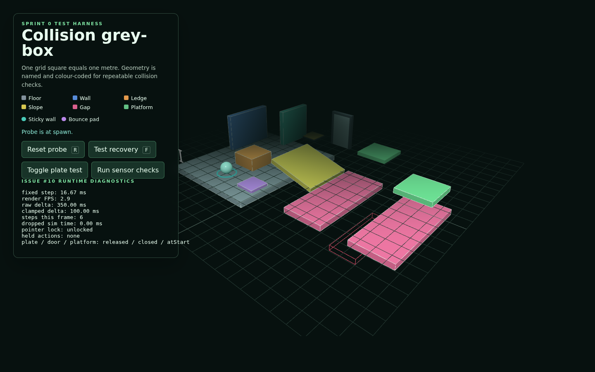

# Issue #18 verification evidence

Verified on 18 August 2026 with Node.js 24.15.0, npm 11.12.1, and headless
Chromium using SwiftShader WebGL.

## Automated checks

```text
npm ci              # 25 packages installed; 0 vulnerabilities
npm run type-check  # passed
npm run build       # passed with Vite 8.2.1
git diff --check    # passed
```

The production output was served from `archive/game/`. The HTML and generated
JavaScript/CSS assets all returned HTTP 200 through relative paths.

## Browser checks

The interactive grey-box component rig was tested in the production build.

```text
Sensor checks passed: duplicate, multiple, and exit occupancy are stable.
plate / door / platform: pressed / open / atEnd
plate / door / platform: released / closed / atStart
```

The plate held its active state while one of two occupants remained. The rig
then returned all components to authored state through the reset path. No
JavaScript runtime exceptions occurred; only the generated JavaScript and CSS
assets were requested.



## Deferred integration

The moving platform exposes its fixed-step pose and displacement, but does not
move a player body itself. Reliable player riding is deliberately deferred to
the `KinematicBody` integration in issue #11, as required by the issue's stated
ownership boundary.
