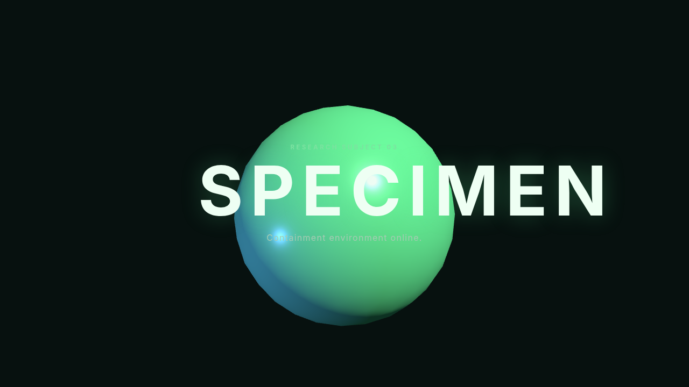

# Issue #2 verification evidence

Verified on 18 August 2026 with Node.js 24.14.1, npm 11.18.0, and Chromium.

## Automated checks

```text
npm ci              # 25 packages installed; 0 vulnerabilities
npm run type-check  # passed
npm run build       # passed with Vite 8.2.1
git diff --check    # passed
```

The production build contains only `index.html` and its generated JavaScript and
CSS assets. Vite reports the initial Three.js bundle as 522.78 kB minified
(131.18 kB gzip); route-level splitting is deferred until the project has real
gameplay routes or asset boundaries.

## Browser checks

The Vite development entry point was opened in Chromium at 1280 × 720. It loaded
the HTML, Vite client, TypeScript entry point, Three.js dependency, and stylesheet
with HTTP 200 responses. The page created one working WebGL canvas and produced
no console warnings or errors.

For the archive-path test, the contents of `dist/` were copied beneath
`archive/game/` and served by a plain static HTTP server. Chromium loaded:

```text
GET /archive/game/                                200 OK
GET /archive/game/assets/index-zJjjcf-D.js        200 OK
GET /archive/game/assets/index-C9JHGjyE.css       200 OK
```

The nested build created one working WebGL canvas and produced no console
warnings or errors. The generated HTML references both built assets with `./`
URLs.



## Scope and resources

No gameplay, deployment automation, or third-party content assets were added.
The Three.js geometry, material, renderer, animation loop, timer, and resize
listener are disposed during Vite hot replacement. Software dependencies and
licenses are recorded in `CREDITS.md`.
