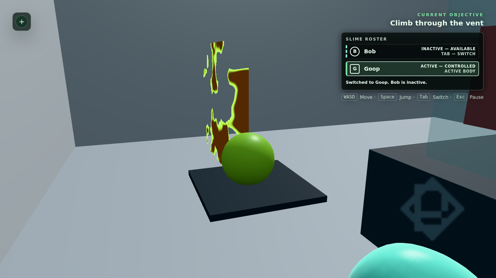
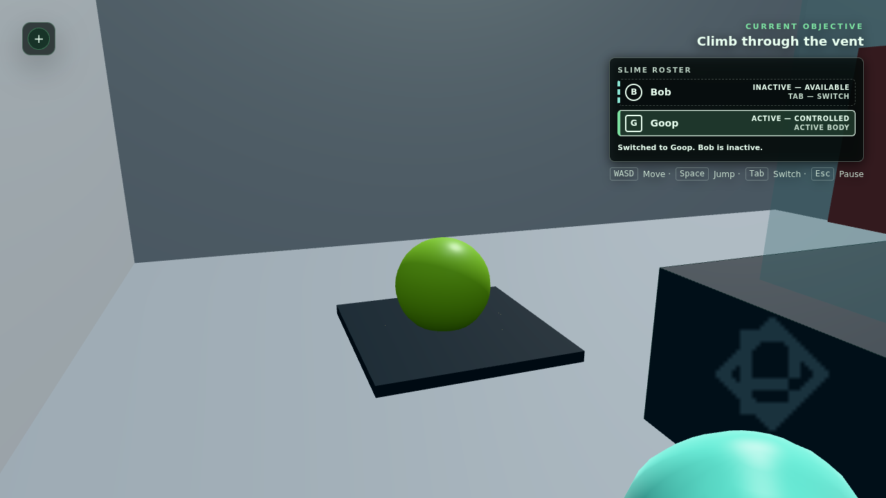
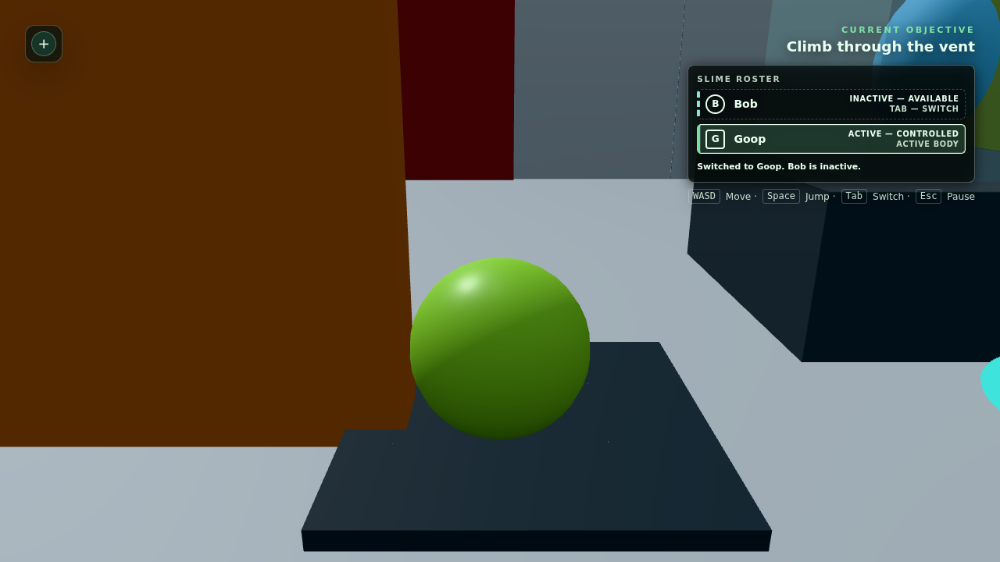

# Issue #31 verification evidence

Issue #31 replaces the temporary opacity fade with a deterministic,
gameplay-driven corrosion shader. This record distinguishes checks performed
against the development server from the production `dist/` verification.

## Automated checks

Verified on 21 August 2026 with Node.js 24.19.0, npm 11.18.0, and headless
Chrome 152.0.0.0 on Linux.

```text
npm ci              passed; 25 packages, 0 vulnerabilities
npm test            passed; 110/110 tests
npm run type-check  passed
npm run build       passed; 66 modules transformed
npm run archive     passed; archive root and integrity validated
git diff --check    passed
```

The production output was 798.59 kB minified / 199.57 kB gzip for the single
JavaScript chunk, 10.91 kB / 3.47 kB gzip for CSS, and 0.82 kB for HTML. Vite's
existing advisory about a chunk over 500 kB remains; the dissolve shader adds
no separate runtime asset and this issue does not introduce a loading boundary.

`tests/DissolveTarget.test.ts` covers:

- gameplay progress copied exactly to visible, depth, and distance uniforms;
- partial progress retained while gameplay is interrupted;
- resume through completion;
- collision state retained below and removed at the authored threshold;
- five complete/reset cycles with a zeroed render value after each reset;
- independent amounts and deterministic target-ID offsets for two targets;
- multi-material targets sharing one coherent mask state;
- source `MeshStandardMaterial` roughness, metalness, colour, and emissive
  response preserved by the dissolve material;
- visible shader injection retaining Three.js's standard-lighting path while
  adding only threshold discard and emissive edge;
- depth/distance shader hooks containing the matching noise discard;
- idempotent disposal and restoration of borrowed authored materials.

## Browser cycle

The Room 1 proof target was exercised in Chrome through the actual keyboard
path: `Tab` selected Goop, movement established contact, held `E` advanced the
fixed-step dissolve, releasing `E` held the partial value, and holding `E`
again resumed it.

The post-review production pass observed:

```text
0%   intact, collision registered
44%  interrupted for one second, remained exactly 44%, collision registered
72%  collision and surface registrations changed from 130 to 129
100% complete, target invisible
reset progress 0%, target intact, collision/surface registration restored
```

The captured 51% state had stable irregular openings and a bright green-white
boundary.
At the 72% authored gameplay threshold the visible state and collision
diagnostics remained synchronised. Reset reused the same target and cleared the
partial pattern without a reload.

Two consecutive complete/reset cycles were then run from the production build
served by `vite preview`; both returned to `progress = 0`, `completed = no`,
and collision enabled before the next cycle. The production archive was also
served from `/group-folder/`. Its HTML, relative CSS, and relative JavaScript
requests all returned HTTP 200; a partial held at 39%, then resumed to 100% and
reset to 0% with no console messages or failed requests.

## Captures







[`issue-31-dissolve-reset.webm`](issue-31-dissolve-reset.webm) is a 1280 × 720
browser capture of the live intact → partial → complete → reset cycle. Chrome
loaded the saved WebM successfully, reported a 25.4 second duration, and sample
frames at 5, 9, 13, 17, 21, and 25 seconds were visually inspected. The orange
target is clearly in frame while intact, during corrosion, after removal, and
after restoration; the recording is no longer aimed only at the pedestal.

## Shadow/depth inspection

`RenderLayer` currently sets `renderer.shadowMap.enabled = false`; the proof
target retains Three.js's default `castShadow = false`. It therefore produces
no current shadow to inspect visually. Source and automated inspection confirm
that every dissolve target still owns compatible custom directional depth and
point-light distance materials. Both share the visible mask uniforms and inject
the same fragment discard, preventing an intact shadow silhouette if a future
authored target participates in either shadow pass.

An isolated 64 × 64 Chrome render then enabled both a shadow-casting
directional light and point light on a 50%-dissolved mesh. Three.js allocated
both shadow maps and compiled five programs, including the visible standard,
directional-depth, point-distance, and receiver paths, without a GLSL/link
error. A separate pixel readback with the dissolve amount at zero changed from
black `[0, 0, 0, 255]` with the point light disabled to lit
`[255, 255, 255, 255]` when enabled. This confirms that the dissolve surface is
using the actual Three.js scene-light contract rather than fixed inspection
light uniforms. All temporary materials, geometries, shadow maps, render target,
and the diagnostic renderer were disposed afterward.

## Console, network, and resources

The production cycles completed with zero console errors or warnings. The
archive server mounted the built output at `/group-folder/`; its three requests
(HTML, relative JS, and relative CSS) all returned HTTP 200 with no failed
requests, covering the repository's subdirectory deployment requirement.

Renderer diagnostics stayed at 103 geometries, 3 textures, and 9 shader
programs across two consecutive intact → complete → reset cycles in a fixed
view. Draw calls dropped when the target became invisible and returned with the
restored target. Repeated production cycles did not continually add renderer
resources.

The shared automation host uses software/virtualised WebGL and was heavily
loaded: a 120-frame intact sample measured 246.88 ms mean / 242.30 ms median,
while a 40-frame close-up partial sample measured 265.88 ms / 262.10 ms. The
different framing and sample lengths prevent treating this as a controlled GPU
benchmark. Fixed draw/resource counts, one affected proof mesh, no additional
texture reads, and no per-frame allocations establish that this cycle did not
show continual renderer-resource growth.

**Performance acceptance status: pending representative hardware
verification.** These software-WebGL timings do not establish acceptable
production performance. A Chrome/Ubuntu run on representative physical lab
hardware remains required before that criterion can be marked pass.

## Authorship and credits

The dissolve value-noise interpolation, octave composition, gameplay threshold,
edge, standard-material integration, and shadow-pass integration were written
for Specimen. The lattice hash adapts David Hoskins's MIT-licensed “Hash without
Sine” `hash13`; `CREDITS.md` now records its author, source, licence, and use.
No external texture or shader asset is used.
