# Issue #33 verification evidence

Issue #33 replaces the global inspection lights with a Level 1-owned,
room-gated lighting rig and deterministic presentation states for issue #38.
The final production archive was served from `/group-folder/` so this record
also covers relative deployment paths.

## Automated checks

Run on 23 August 2026:

```text
npm run type-check  passed
npm test            passed; 157/157 tests
npm run build       passed; 82 modules transformed
npm run archive     passed; archive root validated
```

`tests/ContainmentLighting.test.ts` covers visible-source fixtures, room
visibility gating, bounded authored/shadow-light counts, direct mapping from
the authoritative elevator and Room 5 ending state, transient-particle reset,
and identical completed/skipped final signatures.

## Built-browser visual pass

The built archive was opened in Chrome through the normal gameplay camera.
The Room 1 sticky wall and complete Room 1-to-2 duct were traversed with
keyboard controls through the Room 2 drop. Room entry checkpoints were then
used to inspect the remaining authored rigs without changing camera or level
geometry. The pass checked:

- the clinical pedestal/glass key and locked-door indicator in Room 1;
- a dark but traced duct floor, ribs, rising run, final cue and readable Bob;
- the three-zone safe progression and platform silhouettes in Room 2;
- distinct green acid response and red beam/emitter language in Room 3;
- amber elevator warning presentation and readable shaft platform in Room 4;
- cool entry, lower route, containment glass, Goop, door and Room 5 chamber;
- normal, warning, opening, reveal and skipped-to-released Room 5 states;
- Bob establishing state entry and return to gameplay presentation.

The debug presentation controls call the same public state interface intended
for issue #38; they do not animate the chamber, lock controls, camera or
characters.

## Reset, skip and resource cycle

Twenty-five synchronous Bob/Goop presentation cycles alternated normal
progression and skip finalisation, then reset. Before and after diagnostics
were identical:

```text
scene objects / lights                 1611 / 25
authored lights active / total / shadow 6 / 23 / 0  (Room 5 active)
GPU geometries / textures              516 / 10
lighting state                         gameplay / normal
particles / manual release drive       0 / no
```

Three full page unload/reload cycles each recreated exactly `1611 / 25` scene
objects/lights, `8 / 23 / 0` active/total/shadow authored lights in Room 1,
and zero active particles. No duplicate fixtures or effects appeared.

The final archive also entered Bob `impact` and Goop `warning`, triggered the
real death/retry flow from the Room 5 entry checkpoint, and recovered to
`gameplay / normal`, `0 / no` particles/manual drive, and the same
`1611 / 25` object/light count.

The final archive loaded one HTML, one relative JavaScript and one relative
CSS resource with HTTP 200 responses. The browser console contained zero
errors and zero warnings; no missing asset or 404 request was observed.

The automation host used software/virtualised WebGL and rendered at only a few
frames per second while screenshots were captured. Those timings are not a
representative performance benchmark. The stable light/resource/particle
counts establish bounded lifecycle behaviour; representative Chrome/Ubuntu
lab-hardware frame performance remains part of issue #42's renderer pass.

## Captures

The pre-lighting baseline is retained in the issue #32 production captures:
[Room 1](issue-32-room-1-cleanup-production-pod-oblique.png),
[duct/vent](issue-32-phase-1.5-final-vent-approach.png),
[Room 2](issue-32-room-2-production-entry.png),
[Room 3](issue-32-room-3-production-entry.png),
[Room 4](issue-32-room-4-production-entry.png), and
[Room 5](issue-32-room-5-production-overall.png). The images below are the
corresponding issue #33 production-archive pass.

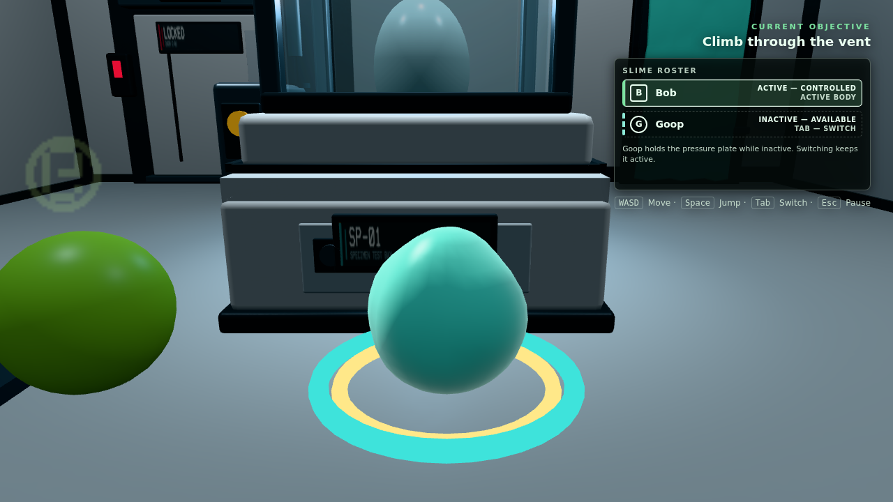

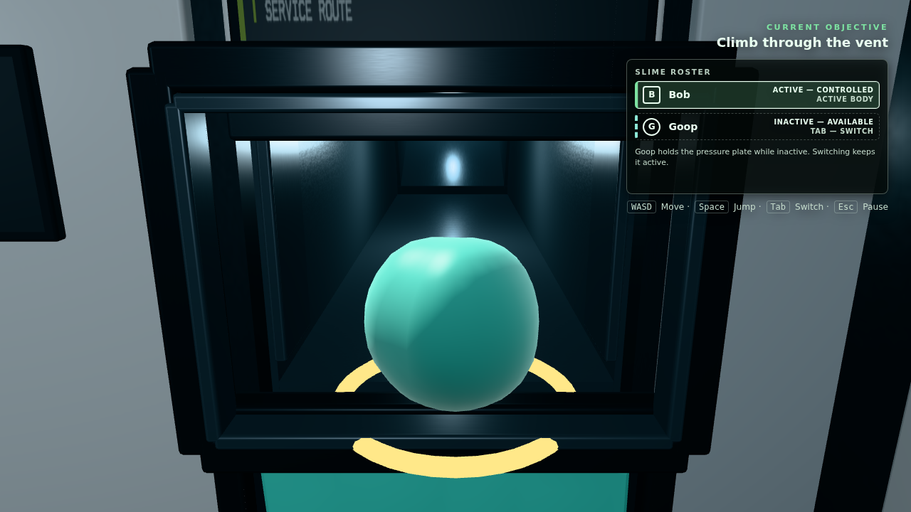

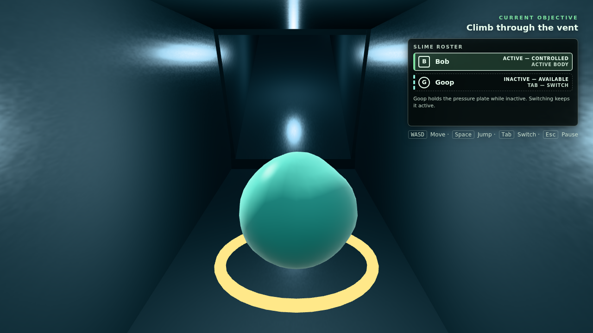

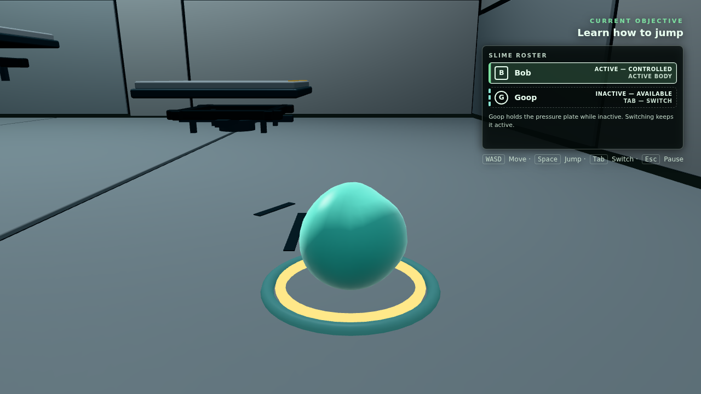

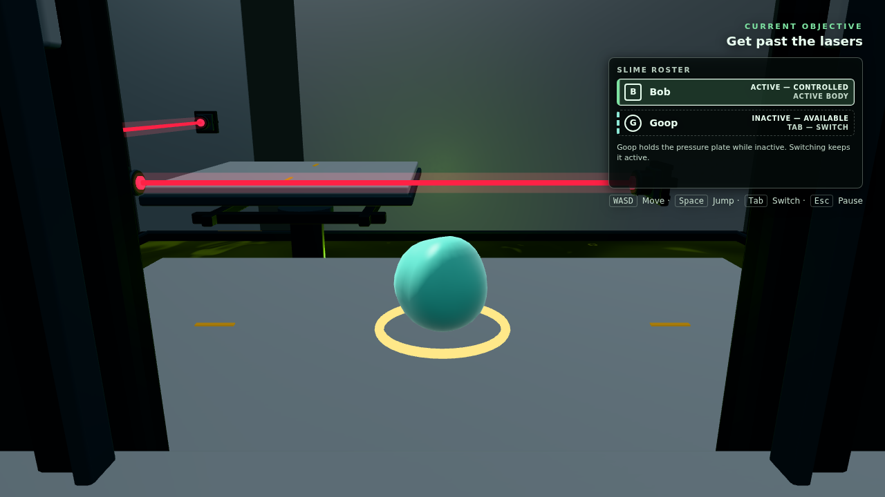

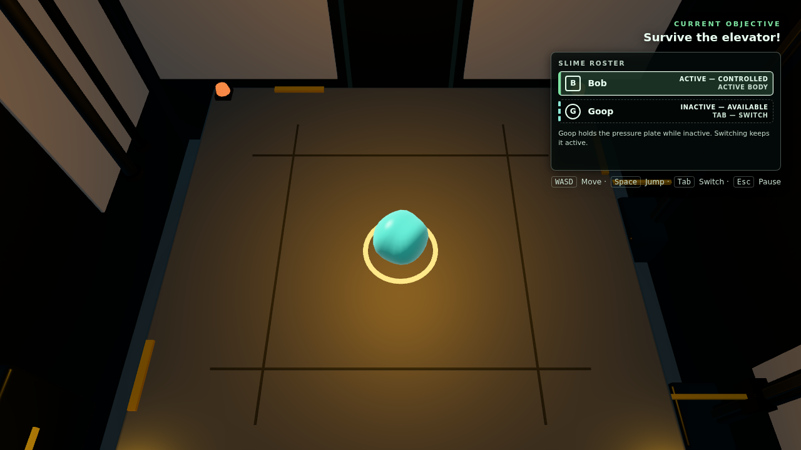

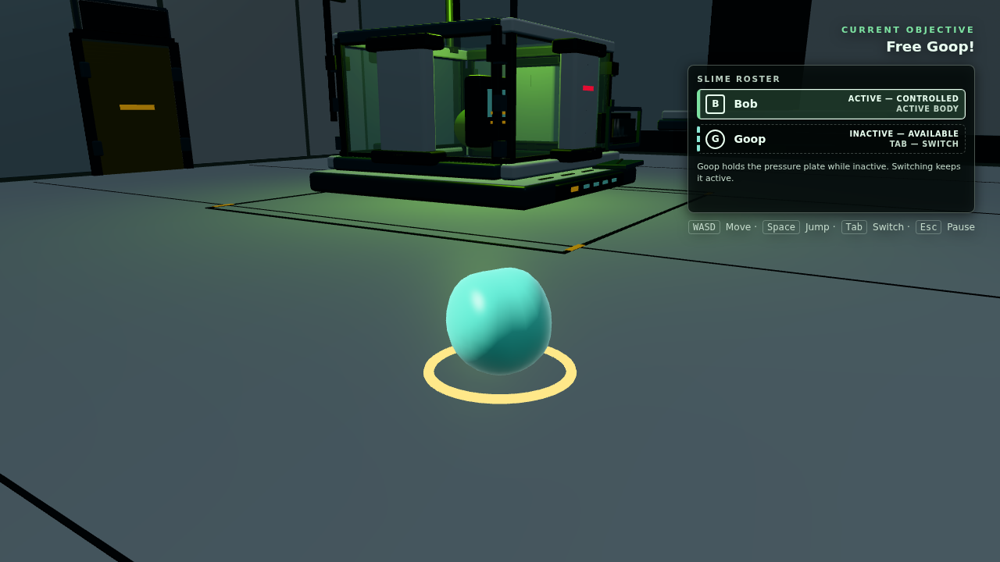

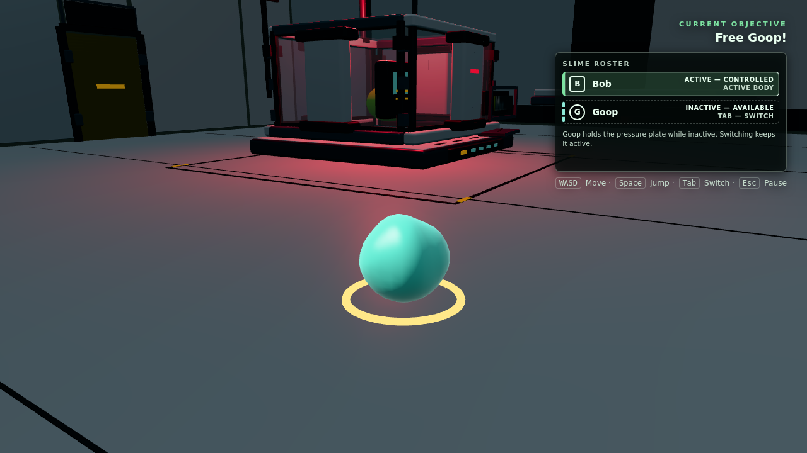

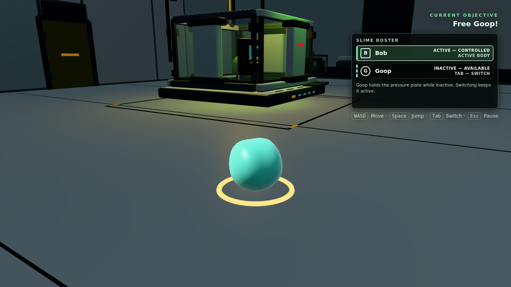

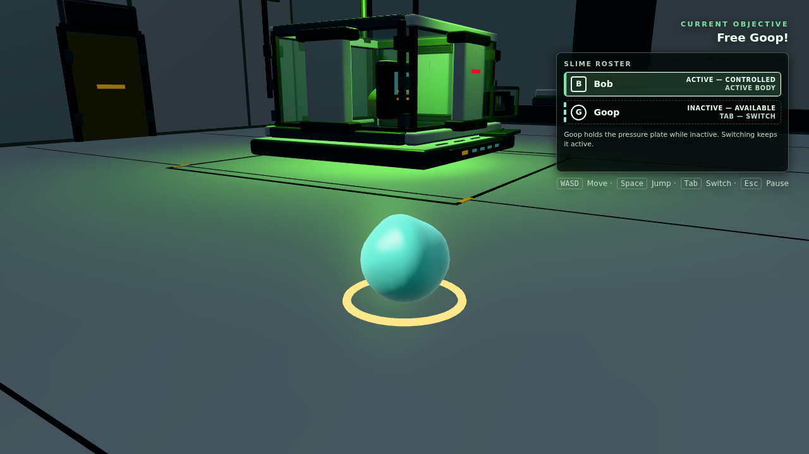

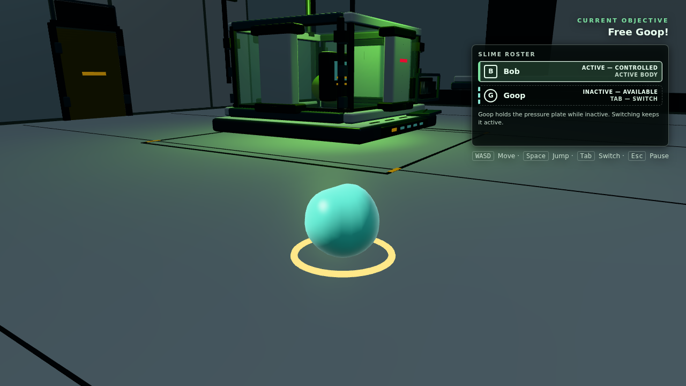

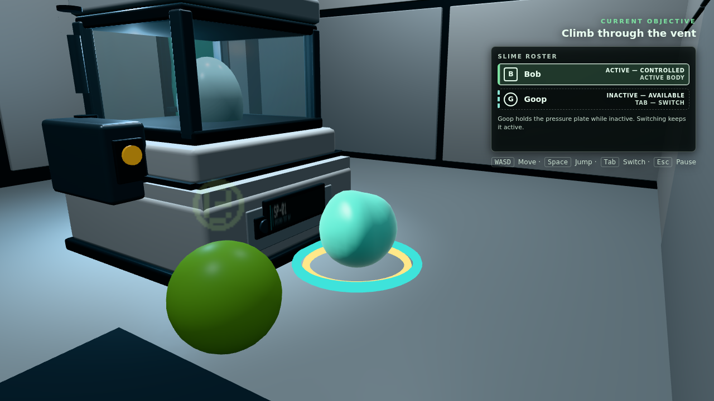

## Scope boundary

Issue #38 still owns cutscene sequencing, cameras, control locking, skip input,
character animation and panel motion. Issue #42 still owns renderer shadow-map
enablement, final shadow/depth tuning, shader integration and representative
hardware performance. No third-party assets were introduced.
