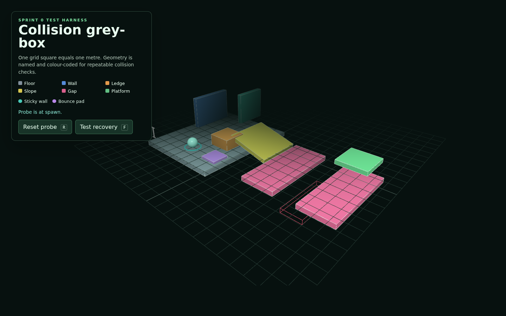

# Issue #7 verification evidence

Verified on 18 August 2026 with Node.js 24.15.0, npm 11.12.1, and headless
Chromium using SwiftShader WebGL.

## Automated checks

```text
npm ci              # 25 packages installed; 0 vulnerabilities
npm run type-check  # passed
npm run build       # passed with Vite 8.2.1
git diff --check    # passed
```

The production output was copied beneath `archive/game/` and served with a
plain static HTTP server. The page, generated JavaScript, and generated CSS all
returned HTTP 200. The built HTML referenced both assets with `./assets/...`
paths.

## Browser checks

Chromium loaded the production build at 1440 × 900. The overview showed the
floor, default wall, sticky wall, ledge, slope, gap, platform, and bounce pad as
distinct colour-coded cases, alongside the one-metre grid, scale bar, cyan spawn
marker, temporary probe, and red recovery volume.

The recovery control produced the expected sequence:

```text
Probe is at spawn.
Probe entered the red recovery volume…
Recovery volume returned the probe to spawn.
```

No JavaScript runtime exceptions occurred and the only requested resources were
the generated JavaScript and CSS assets.



## Scope and resources

No third-party code or content was introduced. The scene contains no movement
controller, collision response, production level layout, final art, or puzzle
scripting. Geometry, materials, controls, and listeners are disposed during
Vite hot replacement.
