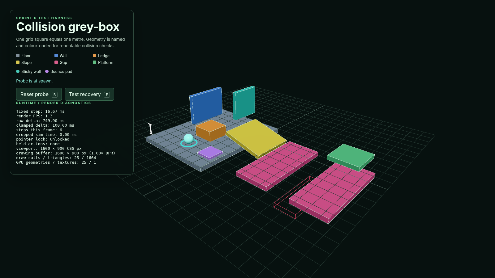
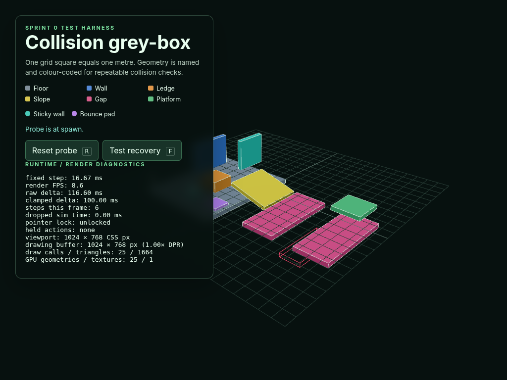
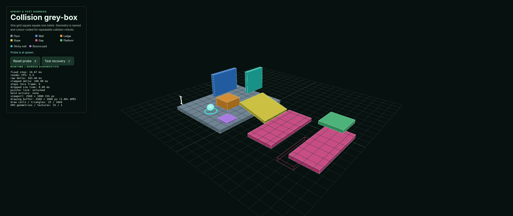

# Issue #8 verification evidence

Verified on 18 August 2026 with Node.js 24.14.1, npm 11.18.0, and headless
Chrome for Testing 152.0.7977.8 using ANGLE/SwiftShader WebGL.

## Automated checks

```text
npm ci              # 25 packages installed; 0 vulnerabilities
npm run type-check  # passed
npm run build       # passed with Vite 8.2.1
git diff --check    # passed
```

The production build emits Vite's advisory that the single JavaScript chunk is
larger than 500 kB: `544.25 kB` minified and `137.53 kB` gzip. This is the
existing Three.js application bundle rather than a graphics or runtime error;
the warning remains enabled and code splitting is deferred until the project
has a meaningful loading boundary.

The repository does not currently expose format, lint, or automated test
scripts. No test framework was added solely for renderer configuration.

## Production browser checks

The built `dist/` directory was copied beneath `archive/game/` and served with a
plain static HTTP server, matching the repository's relative-build workflow.
The page and its generated JavaScript and CSS returned HTTP 200 from that nested
path. Browser instrumentation observed no console warnings, console errors,
uncaught exceptions, failed requests, asset 404s, or other HTTP 4xx/5xx
responses.

The production scene was inspected at these CSS viewport sizes with DPR 1:

| Viewport | Result |
| --- | --- |
| 1600 × 900 (16:9) | Base perspective framing shows every collision case with readable top and side faces. |
| 1024 × 768 (narrow 4:3) | Camera backs away along the same view vector; projection remains undistorted and scene bounds remain inside the canvas. |
| 2560 × 1080 (wide 64:27) | Base framing remains stable and the extra width reveals additional horizontal space without stretching geometry. |

Across the three views, the hemisphere fill preserves readable unlit-side
detail while the directional key separates top, side, and curved surface
normals. No fog or provisional shadows obscure the test geometry. Renderer
diagnostics were stable at 25 draw calls, 1,664 triangles, 25 GPU geometries,
and 1 texture for the current grey-box frame.

A single loaded production page was also resized through 1024 × 768,
2560 × 1080, and 1600 × 900. After each live resize, the canvas CSS size,
drawing-buffer size, diagnostics, camera aspect, and projection update completed
without a console warning or error. In a DPR-3 browser context, an 800 × 600 CSS
viewport produced a 1600 × 1200 drawing buffer and reported 2.00× DPR, confirming
the framebuffer cap.

Headless SwiftShader frame-rate samples are not used as performance evidence;
they reflect software rendering and browser automation overhead.

## Screenshots







## Scope, ownership, and resources

The existing collision/test scene and its level-owned geometry and materials
were retained. `RenderLayer` owns the shared renderer, camera rig, lights, and
resize listeners; application shutdown disposes the level before the render
layer performs final renderer disposal. Diagnostics are sampled four times per
second rather than allocated every frame.

No follow camera, custom shader, environment art, gameplay, collision, or
shadow implementation was added. No third-party code, assets, or references
were introduced, so `CREDITS.md` required no update.
