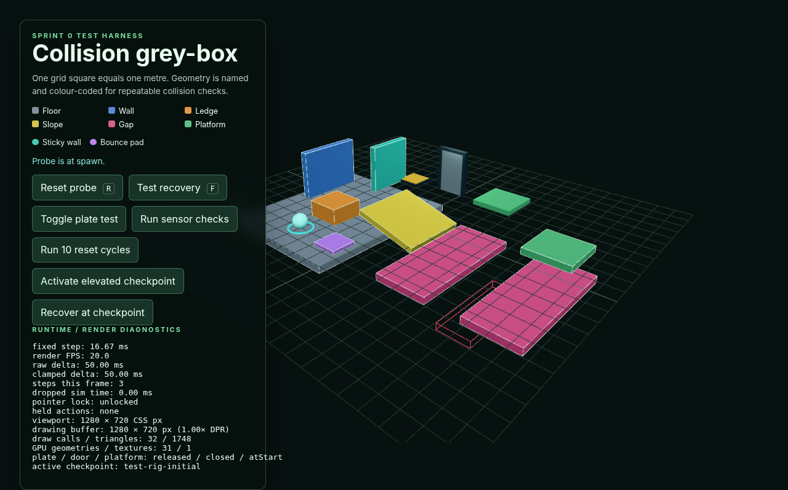

# Issue #9 production archive evidence

Pre-publish verification completed on 19 August 2026 at
00:12 SAST (UTC+02:00). Actual-host verification remains blocked by the open
Issue #6 dependency described below.

## Source state and artifact

- Current HEAD: `260b5cacb6ec4d63487b7fce72c5e959e9916163`
- Branch: `test/prod-build`, tracking `origin/main` at the same revision
- Build output: `dist/index.html`,
  `dist/assets/index-BtAZiQi2.js` (560,297 bytes), and
  `dist/assets/index-C83o0vW3.css` (2,023 bytes)
- Archive: `artifacts/specimen-production.zip` (141,500 bytes)
- Archive SHA-256:
  `ace6886e210358fc96b945eace1e63143430b2734320ec6800e5c8923068671c`

The tested working-tree state is HEAD plus the uncommitted Issue #9 changes:
`.gitignore`, `README.md`, `package.json`,
`scripts/create-production-archive.mjs`,
`docs/production-deployment.md`, this evidence document, and its screenshot.
No application runtime source, Vite configuration, or assets differ from HEAD;
`package.json` only adds the archive command. The evidence files and packaging
documentation are not Vite build inputs.

Two consecutive `npm run archive` runs produced the same SHA-256. Direct ZIP
inspection and `unzip -t` confirmed that `index.html` is at the archive root,
the expected hashed JavaScript and CSS are present beneath `assets/`, and there
is no enclosing `dist/`, `src/`, `node_modules/`, development file, or source
asset.

## Extracted nested-path verification

The ZIP was extracted outside the repository to:

```text
/tmp/specimen-issue9-smoke-fMoPgd/static/gradient-ascenders/
```

The parent `static/` directory was served with Python's static HTTP server, not
Vite, and the extracted artifact was opened at:

```text
http://127.0.0.1:4173/gradient-ascenders/
```

Headless Chrome 152.0.0.0 on Linux, using ANGLE/SwiftShader WebGL, rendered the
visible test scene in one 1280 × 720 canvas. The page showed the Collision
grey-box heading and live renderer diagnostics, including 32 draw calls, 1,748
triangles, 31 GPU geometries, and 1 texture for the captured frame.

Browser and server instrumentation recorded only these requests, all HTTP 200:

```text
GET /gradient-ascenders/
GET /gradient-ascenders/assets/index-BtAZiQi2.js
GET /gradient-ascenders/assets/index-C83o0vW3.css
```

All loaded resources remained beneath the nested path. None targeted a Vite
development server, another localhost port, `src/`, `node_modules/`, or the
repository. A fresh instrumented reload recorded zero console errors, uncaught
page exceptions, failed requests, or HTTP 4xx/5xx responses.

Chrome emitted four explained WebGL driver performance warnings about
`ReadPixels` while the software-rendered page was captured by browser
automation. They are browser/SwiftShader readback diagnostics, not application
exceptions, asset failures, or production-host requests.



## Published-host dependency

The actual publish and public-URL acceptance criteria are not satisfied. The
authoritative [Issue #6](https://github.com/Gradient-Ascenders/Specimen/issues/6)
is open, has no comments or confirmed answers, and does not establish a publish
mechanism, destination/group path, URL, administrative owner/process, or
credentials. The repository also has no deployment workflow, publish command,
host URL, or deployment remote. Publishing safely from this environment is
therefore impossible without inventing requirements or bypassing the required
administrative confirmation.

The remaining manual/external action is for the Issue #6 owner or course
administrator/mentor to record the authoritative hosting and upload process.
An authorised publisher must then publish the prepared ZIP using that process,
open the resulting exact URL in Chrome, rerun the console/network/asset checks,
and add the URL, verification time, browser result, and published-host
screenshot here. Localhost evidence must not be used to close that criterion.

## Checks and scope

`npm ci`, `npm run type-check`, `npm run build`, `npm run archive`, archive
integrity/listing checks, and `git diff --check` passed. The build retains
Vite's existing advisory for the single JavaScript chunk over 500 kB; Issue #9
introduced no new runtime code or concrete deployment performance defect, so
code splitting remains out of scope.

The repository has no format, lint, or automated test scripts. No third-party
code, assets, dependencies, or runtime resources were introduced, so
`CREDITS.md` required no change. The archive tooling runs only during local
packaging and creates no browser resource or disposal obligation.
